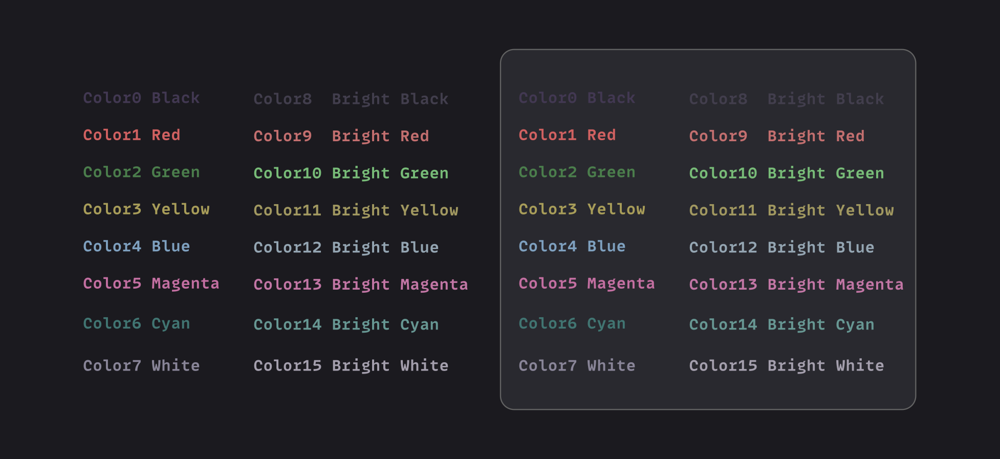
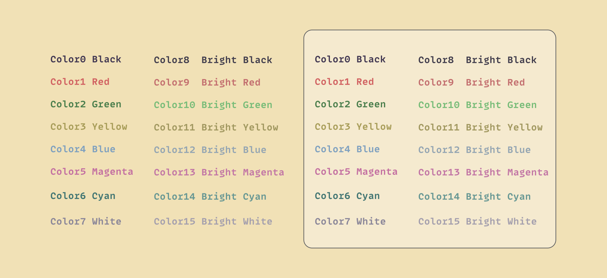

## About CaasiColors

CaasiColors is a carefully crafted color scheme designed for developers who spend long hours looking at code. Drawing inspiration from beloved palettes like [Solarized](https://ethanschoonover.com/solarized/), [Atom's text editor](https://atom-editor.cc/) One Dark, and [Nord](https://www.nordtheme.com/), CaasiColors aims to create a balanced visual experience that reduces eye strain while maintaining excellent contrast, readability and familiarity.

The palette features both dark and light variants, each meticulously selected to work harmoniously across various development environments including editors and terminals, but also web applications.

Thisc color scheme tries to prioritize not only aesthetic appeal but also functional clarity to enhance your coding experience regardless of the time of day.

## Color palette

### Dark Theme

| Color      | Hex       | RGB          |
| ---------- | --------- | ------------ |
| Background | `#1b1a1f` | `27, 26, 31` |
| Card       | `#29292f` | `41, 41, 47` |
| Border     | `#636363` | `99, 99, 99` |

### Light Theme

| Color      | Hex       | RGB             |
| ---------- | --------- | --------------- |
| Background | `#f1e1b6` | `241, 225, 182` |
| Card       | `#f5eacf` | `245, 234, 207` |
| Border     | `#636363` | `99, 99, 99`    |

### Common Colors

| Color                  | Hex       | RGB             |
| ---------------------- | --------- | --------------- |
| Color0 Black           | `#423852` | `66, 56, 82`    |
| Color1 Red             | `#d16161` | `209, 97, 97`   |
| Color2 Green           | `#4b7e4c` | `75, 126, 76`   |
| Color3 Yellow          | `#a89d59` | `168, 157, 89`  |
| Color4 Blue            | `#7ea0bf` | `126, 160, 191` |
| Color5 Magenta         | `#c36fa1` | `195, 111, 161` |
| Color6 Cyan            | `#417572` | `65, 117, 114`  |
| Color7 White           | `#898598` | `137, 133, 152` |
| Color8 Bright Black    | `#423e4d` | `66, 62, 77`    |
| Color9 Bright Red      | `#c36f6f` | `195, 111, 111` |
| Color10 Bright Green   | `#78bc78` | `120, 188, 120` |
| Color11 Bright Yellow  | `#a19860` | `161, 152, 96`  |
| Color12 Bright Blue    | `#94a5b2` | `148, 165, 178` |
| Color13 Bright Magenta | `#c276a5` | `194, 118, 165` |
| Color14 Bright Cyan    | `#679793` | `103, 151, 147` |
| Color15 Bright White   | `#a49fad` | `164, 159, 173` |

## Roadmap

- [x] [.Xresources](https://raw.githubusercontent.com/caasidev/CaasiColors/refs/heads/main/src/.Xresources)
- [x] [CSS](https://raw.githubusercontent.com/caasidev/CaasiColors/refs/heads/main/src/caasicolors.css)
- [-] Terminal emulators
  - [x] [Alacritty](https://raw.githubusercontent.com/caasidev/CaasiColors/refs/heads/main/src/alacritty.toml)
  - [ ] Gnome terminal
  - [x] [Kitty](https://raw.githubusercontent.com/caasidev/CaasiColors/refs/heads/main/src/kitty.conf)
  - [ ] Konsole terminal
  - [ ] XFCE terminal
- [ ] COSMIC desktop
- [ ] VSCode theme
- [ ] Zed Editor theme
- [ ] Neovim theme
- [ ] Tailwind color theme
- [ ] ...

Copyright &copy; 2025 <a href="https://caasi.dev" target="_blank">Jakub Gawlik | caasi.dev</a>

